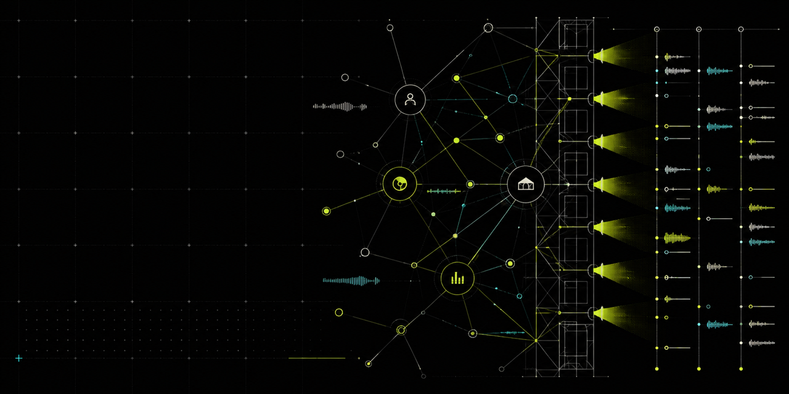
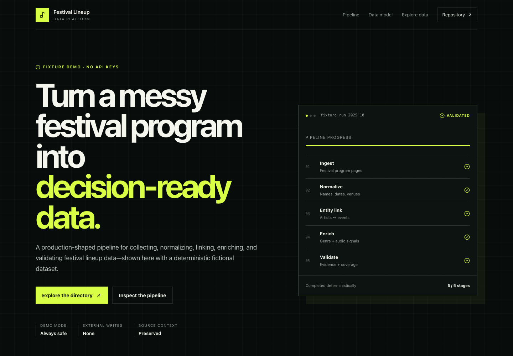
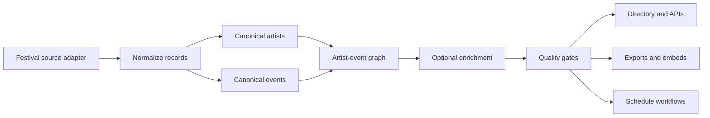

# Festival Lineup Data Platform

[](https://github.com/1aday/festival-lineup-data-platform/actions/workflows/ci.yml)
[](https://nextjs.org/)
[](https://www.typescriptlang.org/)
[](https://ade-eta.vercel.app/)
[](LICENSE)



Turn fragmented festival programs into normalized, linked, and quality-scored artist and event data.

The repository demonstrates the complete shape of a festival-data product: source adapters, canonical records, artist-event relationships, enrichment, validation, public discovery pages, exports, embeds, and itinerary tooling. Amsterdam Dance Event is the featured source adapter; the product model is festival-neutral.

**[Open the live fixture demo](https://ade-eta.vercel.app/)** · **[Explore the artist directory](https://ade-eta.vercel.app/artists)**

> The homepage is intentionally safe to open: it uses three fictional artists and three fictional events, requires no API keys, performs no external writes, and cannot trigger payment calls.



## What this shows

- **Data ingestion:** bounded adapters collect public festival artist and event records.
- **Normalization:** inconsistent names, dates, venues, genres, and source fields become typed canonical records.
- **Entity resolution:** artist appearances remain connected to events and venues instead of collapsing into a flat spreadsheet.
- **Enrichment:** optional Spotify and Supabase integrations add music and storage context from server-side credentials.
- **Evidence and quality:** source URLs, coverage fields, and deterministic fixture validation make the output inspectable.
- **Delivery:** the same data powers search, SEO pages, APIs, embeds, exports, and schedule planning.

The commit-pinned fallback snapshot currently contains **3,799 artist records** and **1,341 event records**. Those counts describe the bundled files in `data/`; they are not presented as live-source totals.

## Architecture



The public demo follows the same presentation path using local fixtures. Live adapters and provider-backed enrichment are optional and isolated behind environment configuration.

## Quick start

Requirements: Node.js 20.9 or newer and npm 10 or newer.

```bash
git clone https://github.com/1aday/festival-lineup-data-platform.git
cd festival-lineup-data-platform
npm ci
npm run dev
```

Open [http://localhost:3000](http://localhost:3000). No environment file is needed for the fixture experience.

## Verification

```bash
npm run lint:showcase
npm run typecheck
npm test
npm run build
npm audit --omit=dev --audit-level=high
```

`npm run check` runs the showcase lint, full TypeScript validation, fixture relationship test, and production build in sequence.

The fixture test verifies:

- unique artist and event IDs;
- required names, countries, genres, venues, and dates;
- normalized energy and BPM bounds;
- every event-to-artist relationship against the canonical fixture set; and
- the counts rendered on the homepage.

## Configuration

Copy `.env.example` to `.env.local` only when enabling an optional integration.

| Capability | Variables | Required for demo? |
| --- | --- | --- |
| Public app URL | `NEXT_PUBLIC_APP_URL` | No |
| Remote read-only dataset | `NEXT_PUBLIC_ADE_DATA_URL` | No |
| Supabase storage | `NEXT_PUBLIC_SUPABASE_URL`, `NEXT_PUBLIC_SUPABASE_ANON_KEY`, `SUPABASE_SERVICE_ROLE_KEY` | No |
| Spotify enrichment | `NEXT_PUBLIC_SPOTIFY_CLIENT_ID`, `SPOTIFY_CLIENT_ID`, `SPOTIFY_CLIENT_SECRET` | No |
| Optional commercial modules | `ENABLE_MONETIZATION`, `NEXT_PUBLIC_ENABLE_MONETIZATION`, `STRIPE_SECRET_KEY` | No; disabled by default |

The Spotify client secret, Supabase service role, and Stripe secret are server-only. No secret variable uses a `NEXT_PUBLIC_` prefix.

## Useful surfaces

| Route | Purpose | Data mode |
| --- | --- | --- |
| `/` | Pipeline and product walkthrough | Fictional fixtures only |
| `/artists` | Searchable artist directory | Bundled fallback or configured provider |
| `/events` | Event records and lineup context | Bundled fallback or configured provider |
| `/countries` | Country coverage index | Bundled fallback or configured provider |
| `/genres` | Curated and source-derived genres | Bundled fallback or configured provider |
| `/festivals/amsterdam-dance-event` | Featured adapter view | Bundled fallback or configured provider |
| `/api/artists`, `/api/events` | Read APIs with demo fallback | Local fallback when unconfigured |

## Repository shape

```text
app/                 Production Next.js routes
components/          Reusable product and SEO surfaces
data/                Commit-pinned fallback records
lib/                 Normalization, matching, access, and provider modules
scripts/             Export, enrichment, and validation utilities
supabase/             Optional storage schemas and migrations
workers/              Optional edge data service
legacy/               Preserved operator-console source, excluded from production
docs/assets/          Repository hero and verified UI capture
```

The old scraper/operator pages were moved to `legacy/` because they were useful provenance but not production-quality TypeScript. They are intentionally excluded from routing, lint, and builds rather than hidden behind `ignoreBuildErrors`.

## Data and safety boundaries

- The project is account- and event-level; it does not discover personal contact information.
- The homepage uses fictional fixtures. Real names in `data/` came from public festival program material.
- Source records retain URLs and context so downstream claims can be traced.
- Optional integrations are read-only until an operator explicitly configures credentials and invokes a workflow.
- Monetization modules are disabled by default and are not linked from the fixture homepage.
- Never commit `.env.local`, generated logs, provider secrets, or database service-role values.

## Limitations

- Source markup and APIs can change; adapters require maintenance and respectful rate limits.
- Entity matching is deterministic and can require manual review for aliases or duplicate stage names.
- Spotify coverage depends on provider availability and matching confidence.
- The bundled snapshot is evidence for the implementation, not a promise of current festival completeness.
- Internal operator-console experiments remain available under `legacy/` but are not part of the supported application.

## Provenance

This repository began as an Amsterdam Dance Event-specific application named `ade`. It was rebuilt into a descriptive, festival-neutral portfolio project while keeping the original ADE workflow as its featured adapter. It is an independent project and is not affiliated with Amsterdam Dance Event, Spotify, Supabase, or Vercel.

## License

[MIT](LICENSE) © Amir Jaffari
